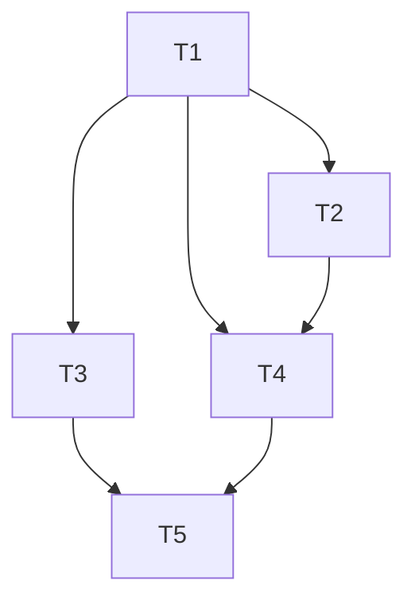

# Tasks: Autenticação e Acesso

## Status Tracker

- [x] **T1**: Implementar `Usuario` entity, `PerfilEnum` e `UsuarioRepository`.
- [x] **T2**: Implementar `RegisterRequestDto`, `LoginRequestDto`, `AuthResponseDto`, e `UsuarioConflictException`.
- [x] **T3**: Implementar `JwtService`, `JwtAuthFilter`, `CustomAuthenticationEntryPoint` e `SecurityConfig`.
- [x] **T4**: Implementar `UsuarioService` orquestrando repositório, BCrypt e validação de CREA.
- [x] **T5**: Implementar `AuthController` com endpoints de `/register` e `/login`.

## Task Breakdown

### T1: Domínio e Persistência
What: Implementar `Usuario` entity, `PerfilEnum` e `UsuarioRepository`.
Where: Pacotes `usuario.domain` e `usuario.persistence`.
Depends on: None
Tests: Testes unitários puros verificando construtores e invariantes de domínio. Teste DataJpa (`@DataJpaTest` ou contexto) para verificar as queries e restrições de unicidade no banco (email).
Gate: `mvnw clean test` passa.

### T2: DTOs e Regras da Aplicação
What: Implementar `RegisterRequestDto`, `LoginRequestDto`, `AuthResponseDto`, e `UsuarioConflictException`.
Where: Pacote `usuario.application`.
Depends on: T1
Tests: Testes unitários com Bean Validation (`Validation.buildDefaultValidatorFactory()`) garantindo que e-mails inválidos ou senhas vazias quebram o contrato antes de chegar ao controller.
Gate: `mvnw clean test` passa.

### T3: Configuração de Segurança e JWT
What: Implementar `JwtService`, `JwtAuthFilter`, `CustomAuthenticationEntryPoint` e a configuração base `SecurityConfig`.
Where: Pacote genérico `config.security`.
Depends on: T1
Tests: Testes unitários do `JwtService` gerando e extraindo claims válidas/inválidas.
Gate: `mvnw clean test` passa.

### T4: Casos de Uso (Service)
What: Implementar `UsuarioService` orquestrando repositório, BCrypt e validação de CREA.
Where: Pacote `usuario.application`.
Depends on: T1, T2
Tests: Testes com Mockito garantindo que (1) `ROLE_CLIENTE` anula o CREA, (2) `ROLE_ENGENHEIRO` sem CREA lança erro, (3) Email duplicado lança `UsuarioConflictException`.
Gate: `mvnw clean test` passa.

### T5: API Rest (Controller)
What: Implementar `AuthController` com endpoints de `/register` e `/login`.
Where: Pacote `usuario.web`.
Depends on: T3, T4
Tests: `@WebMvcTest` testando rotas abertas, serialização de resposta e integração da formatação de erro com `GlobalExceptionHandler` e o `EntryPoint` de segurança.
Gate: `mvnw clean test` passa.

## Execution Plan

## Test Coverage Matrix
| Module | Core Logic | Test Type |
|--------|------------|-----------|
| Domain | Entity rules | Unit |
| Persistence | Query by email | Integration |
| Application | BCrypt, CREA logic | Unit |
| Web | Routing & Auth | Integration |

## Gate Check Commands
- **Unit & Integration:** `./mvnw clean test`
