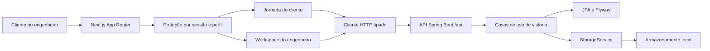

# Experiência Vistor.IA Design

**Spec**: `.specs/features/frontend-redesign/spec.md`
**Status**: Approved

---

## Architecture Overview

A implementação seguirá uma entrega vertical sobre o monólito modular existente. O backend continua como fonte de verdade de autenticação, autorização, estados e evidências; o Next.js organiza a interface por feature e usa componentes cliente somente nas fronteiras que dependem de `localStorage`, formulários, upload e leitura autenticada. Não será criado BFF, estado global externo ou contrato mockado no navegador.



### Abordagens consideradas

| Abordagem | Vantagens | Custos / riscos | Decisão |
| --- | --- | --- | --- |
| Frontend por feature + REST tipado direto para o Spring | Preserva a API existente, mantém autorização no backend, reduz dependências e separa as jornadas por papel. | A sessão em `localStorage` obriga as telas autenticadas a terem uma fronteira cliente. | **Recomendada** |
| BFF em Route Handlers do Next.js + cookie HttpOnly | Melhor isolamento do token e possibilidade de renderização autenticada no servidor. | Muda a estratégia de autenticação explicitamente excluída da spec e duplica uma fronteira HTTP. | Rejeitada nesta entrega |
| Páginas monolíticas com chamadas `fetch` locais | Menor quantidade inicial de arquivos. | Repete contratos, tratamento de erro e estados; reproduz a desorganização atual. | Rejeitada |

## Conformidade com decisões do projeto

- **AD-001 e AD-005**: o backend permanece um monólito modular e a entrega é vertical por feature.
- **AD-004**: pré-laudo e decisão técnica continuam separados; a interface declara que a IA é preliminar.
- **AD-006**: o frontend permanece Next.js com App Router e comunicação REST/JWT.
- O `pom.xml` atual usa Spring Boot **3.2.3**. As referências a 4.1.1 em `AGENTS.md` e `.specs/STATE.md` estão desatualizadas; o plano não altera versão de framework e usa o build real como fonte de verdade.

---

## File Structure

```text
frontend/src/
├── app/
│   ├── (dashboard)/
│   │   ├── client/
│   │   │   ├── layout.tsx
│   │   │   ├── page.tsx
│   │   │   └── vistorias/
│   │   │       ├── nova/page.tsx
│   │   │       └── [id]/page.tsx
│   │   └── engineer/
│   │       ├── layout.tsx
│   │       ├── page.tsx
│   │       └── vistorias/[id]/page.tsx
│   ├── login/page.tsx
│   ├── register/page.tsx
│   ├── globals.css
│   ├── layout.tsx
│   └── page.tsx
├── components/
│   ├── brand/brand-mark.tsx
│   ├── shell/dashboard-shell.tsx
│   └── ui/{alert,async-state,button,status-badge}.tsx
├── features/
│   ├── auth/
│   │   ├── auth-form.tsx
│   │   └── protected-area.tsx
│   └── inspections/
│       ├── api.ts
│       ├── protocol.ts
│       ├── status.ts
│       ├── types.ts
│       ├── client/{client-dashboard,inspection-workflow}.tsx
│       ├── engineer/{engineer-queue,engineer-review}.tsx
│       └── shared/{evidence-image,pre-report}.tsx
└── lib/
    ├── api.ts
    └── auth.ts
```

No backend, os novos contratos permanecem dentro da feature `vistoria`; a porta de armazenamento recebe apenas a capacidade transversal de leitura:

```text
src/main/java/br/com/vistoriapredial/
├── storage/{StorageService,StoredFile,LocalStorageService}.java
└── vistoria/
    ├── application/{EvidenceFileValidator,EvidenceContent,VistoriaService}.java
    ├── application/exception/*.java
    ├── domain/ProtocoloVistoria.java
    ├── persistence/{VistoriaRepository,ImagemVistoriaRepository}.java
    └── web/{ImagemVistoriaResponseDto,VistoriaResponseDto,VistoriaController}.java
```

---

## Code Reuse Analysis

### Existing Components to Leverage

| Component | Location | How to use |
| --- | --- | --- |
| Autenticação JWT | `src/main/java/br/com/vistoriapredial/usuario/` e `config/security/` | Consumir `AuthResponseDto.perfil`; manter autorização real no Spring Security. |
| Fluxo de vistoria | `src/main/java/br/com/vistoriapredial/vistoria/` | Preservar estados e transições, endurecendo somente os invariantes necessários à experiência aprovada. |
| Porta de armazenamento | `src/main/java/br/com/vistoriapredial/storage/StorageService.java` | Acrescentar leitura segura sem expor caminho físico no HTTP. |
| Problem Details | `src/main/java/br/com/vistoriapredial/shared/web/error/GlobalExceptionHandler.java` | Mapear erros tipados da feature para 403, 404, 409 e 422 em `application/problem+json`. |
| App Router e Tailwind | `frontend/src/app/` | Preservar rotas existentes e substituir páginas monolíticas por componentes da feature. |
| Ícones | `frontend/package.json` (`lucide-react`) | Usar somente ícones com nome acessível; não adicionar outra biblioteca visual. |

### Integration Points

| System | Integration method |
| --- | --- |
| Login e cadastro | `POST /api/auth/login` e `POST /api/auth/register`, sem inferir perfil pelo e-mail; cadastro de engenheiro exige convite configurado no ambiente. |
| Vistorias do cliente | `POST /api/vistorias`, `GET /api/vistorias/minhas`, upload e submissão autenticados. |
| Revisão técnica | `GET /api/vistorias/pendentes` e `POST /api/vistorias/{id}/analisar`. |
| Evidências | Metadados dentro de `VistoriaResponseDto` e conteúdo em rota autenticada dedicada. |
| Banco | Flyway continua validando o schema; Testcontainers PostgreSQL prova portabilidade das migrations. |

---

## Components and Interfaces

### Backend: protocolo e validação de evidência

- **Purpose**: aceitar somente os doze códigos versionados e arquivos JPEG, PNG ou WebP não vazios de até 10 MiB, validando assinatura básica do conteúdo.
- **Location**: `vistoria/domain/ProtocoloVistoria.java` e `vistoria/application/EvidenceFileValidator.java`.
- **Interfaces**:
  - `void ProtocoloVistoria.validate(String code)`
  - `ValidatedEvidence EvidenceFileValidator.validate(MultipartFile file)`
  - `record ValidatedEvidence(String extension, MediaType mediaType)`
- **Dependencies**: `MultipartFile`, `MediaType` e leitura dos primeiros bytes; nenhuma biblioteca nova.
- **Reuses**: limite multipart de 10 MB já configurado em `application.properties` como defesa adicional.

### Backend: leitura autorizada de evidência

- **Purpose**: carregar uma imagem pelo par vistoria/evidência, verificar ownership ou papel/estado do engenheiro e devolver conteúdo sem caminho interno.
- **Location**: `storage/`, `vistoria/application/`, `vistoria/persistence/` e `vistoria/web/`.
- **Interfaces**:
  - `StoredFile StorageService.load(String relativePath)`
  - `Optional<ImagemVistoria> ImagemVistoriaRepository.findByIdAndVistoriaId(Long imageId, Long inspectionId)`
  - `EvidenceContent VistoriaService.buscarEvidencia(Long vistoriaId, Long imagemId, Usuario usuario)`
  - `GET /api/vistorias/{vistoriaId}/imagens/{imagemId}/conteudo`
- **Dependencies**: `Resource`, `MediaType`, `Usuario.perfil`, `Vistoria.status`.
- **Reuses**: `LocalStorageService` e autenticação do controller.

### Backend: contrato de resposta

- **Purpose**: serializar a vistoria sem disparar acesso lazy fora da transação e sem expor `ImagemVistoria.url`.
- **Location**: `vistoria/web/ImagemVistoriaResponseDto.java`, `VistoriaResponseDto.java` e queries com `@EntityGraph` no repository.
- **Interfaces**:
  - `record ImagemVistoriaResponseDto(Long id, String protocoloItem, LocalDateTime dataUpload, String conteudoUrl)`
  - `record VistoriaResponseDto(..., List<ImagemVistoriaResponseDto> imagens)`
- **Dependencies**: coleção `Vistoria.imagens` carregada nas consultas de lista e detalhe.
- **Reuses**: o DTO atual e os endpoints existentes.

### Frontend: sessão e cliente HTTP

- **Purpose**: centralizar contrato, Bearer, multipart, ProblemDetail e expiração da sessão.
- **Location**: `frontend/src/lib/auth.ts`, `frontend/src/lib/api.ts` e `frontend/src/features/inspections/api.ts`.
- **Interfaces**:
  - `type UserRole = "ROLE_CLIENTE" | "ROLE_ENGENHEIRO"`
  - `type AuthSession = { token: string; usuarioId: number; nome: string; perfil: UserRole }`
  - `readSession(): AuthSession | null`
  - `writeSession(session: AuthSession): void`
  - `clearSession(): void`
  - `roleHome(role: UserRole): "/client" | "/engineer"`
  - `apiFetch<T>(path: string, init?: ApiRequestInit): Promise<T>`
  - `fetchEvidenceBlob(path: string): Promise<Blob>`
- **Behavior**: só define JSON `Content-Type` quando o corpo não for `FormData`; em 401 autenticado, limpa `vistoria.session` e emite `vistoria:session-expired`.

### Frontend: proteção e shell por papel

- **Purpose**: impedir render e requisição da área errada, exibir marca/navegação compartilhada e oferecer logout.
- **Location**: `features/auth/protected-area.tsx`, layouts de `client`/`engineer` e `components/shell/dashboard-shell.tsx`.
- **Interfaces**:
  - `<ProtectedArea allowedRole: UserRole>`
  - `<DashboardShell role: UserRole; userName: string>`
- **Dependencies**: `readSession`, `roleHome`, `useRouter`.
- **Reuses**: rotas `/client`, `/engineer` e `lucide-react`.

### Frontend: jornada do cliente

- **Purpose**: listar casos, criar rascunho, reconstruir o progresso do servidor, anexar evidências e submeter uma única vez.
- **Location**: `features/inspections/client/` e rotas de cliente.
- **Interfaces**:
  - `listMyInspections(): Promise<Inspection[]>`
  - `getMyInspection(id: number): Promise<Inspection>` - seleciona o id dentro da lista autorizada do cliente e produz erro de contrato se ausente.
  - `createInspection(address: string): Promise<Inspection>`
  - `uploadEvidence(id: number, protocolItem: ProtocolItemCode, file: File): Promise<Inspection>`
  - `submitInspection(id: number): Promise<Inspection>`
- **Dependencies**: protocolo fixo, `StatusBadge`, `ApiError` e resposta real da API.
- **Reuses**: estados existentes `EM_RASCUNHO`, `DEVOLVIDA_CLIENTE`, `FALHA_IA`, `AGUARDANDO_IA`, `AGUARDANDO_ENGENHEIRO`, `CONCLUIDA`.

### Frontend: revisão do engenheiro

- **Purpose**: ordenar a fila, abrir o caso, carregar blobs autenticados, estruturar linhas do pré-laudo e registrar parecer.
- **Location**: `features/inspections/engineer/` e rota dinâmica do engenheiro.
- **Interfaces**:
  - `listPendingInspections(): Promise<Inspection[]>`
  - `getPendingInspection(id: number): Promise<Inspection>` - seleciona o id dentro da fila autorizada do engenheiro.
  - `reviewInspection(id: number, aprovado: boolean, parecer: string): Promise<Inspection>`
  - `splitPreReport(text: string | null): string[]`
- **Dependencies**: `EvidenceImage`, `PreReport`, contrato de evidências e status mais recente do servidor.
- **Reuses**: endpoint `/analisar` e cópia Human-in-the-Loop aprovada.

---

## Data Models

```typescript
type UserRole = "ROLE_CLIENTE" | "ROLE_ENGENHEIRO"

type InspectionStatus =
  | "EM_RASCUNHO"
  | "AGUARDANDO_IA"
  | "FALHA_IA"
  | "AGUARDANDO_ENGENHEIRO"
  | "DEVOLVIDA_CLIENTE"
  | "CONCLUIDA"

interface Evidence {
  id: number
  protocoloItem: ProtocolItemCode
  dataUpload: string
  conteudoUrl: string
}

interface Inspection {
  id: number
  clienteId: number
  engenheiroId: number | null
  status: InspectionStatus
  preLaudoIa: string | null
  parecerEngenheiro: string | null
  endereco: string
  dataCriacao: string
  dataConclusao: string | null
  imagens: Evidence[]
}

interface ProblemDetails {
  type?: string
  title?: string
  status: number
  detail: string
  instance?: string
  errors?: Array<{ message: string; pointer: string }>
}
```

Os doze `ProtocolItemCode` serão: `SALA_PISO`, `SALA_PAREDES_REVESTIMENTOS`, `SALA_TETO_ILUMINACAO`, `COZINHA_PISO`, `COZINHA_PAREDES_BANCADAS`, `COZINHA_INSTALACOES`, `BANHEIRO_REVESTIMENTOS`, `BANHEIRO_HIDRAULICA`, `QUARTO_PISO`, `QUARTO_PAREDES_TETO`, `INSTALACOES_ELETRICAS` e `INSTALACOES_HIDRAULICAS`.

---

## Error Handling Strategy

| Error scenario | Handling | User impact |
| --- | --- | --- |
| JSON/ProblemDetail inválido | `ApiError` usa mensagem segura baseada no status | Estado de erro com retry, sem stack trace |
| 401 em chamada autenticada | Limpa sessão e redireciona para login | Mensagem de sessão expirada |
| Papel incompatível | `ProtectedArea` redireciona antes de montar a jornada | Nenhuma requisição indevida |
| Arquivo vazio, grande, MIME ou assinatura inválida | Rejeição cliente e servidor | Erro junto ao item; evidências anteriores preservadas |
| Evidência de outro cliente | Exceção tipada mapeada para 403 | Conteúdo não é exposto |
| Evidência ou arquivo ausente | Exceção tipada mapeada para 404 | Cartão “foto indisponível” |
| Transição concorrente | Exceção de estado mapeada para 409 e refetch | Tela passa a refletir o estado atual |
| Falha de IA | Backend mantém `FALHA_IA`; frontend oferece reenvio explícito | Nenhum sucesso fabricado |

---

## Security and Data Flow

1. O token é persistido somente em `vistoria.session`; senha e convite profissional nunca são persistidos e são limpos após falha.
2. Toda rota de evidência exige JWT e autorização sobre o recurso no caso de uso, não apenas no `@PreAuthorize`.
3. Nomes de arquivo são gerados no servidor por UUID e extensão derivada do conteúdo validado; o nome original não compõe o destino.
4. A API expõe somente URL lógica autenticada. O frontend faz `fetch` Bearer do blob, cria `objectURL` temporária e a revoga no cleanup.
5. Mutação não é repetida automaticamente após 401 ou erro de rede.
6. O backend falha ao iniciar sem segredo JWT forte e compara o convite de engenharia sem atalho de elevação de papel.

---

## Risks & Concerns

| Concern | Location | Impact | Mitigation |
| --- | --- | --- | --- |
| Wrapper Maven falha no PowerShell ao indexar `Target[0]` nulo | `mvnw.cmd:73` | O comando canônico não inicia a suíte | Corrigir o script de forma mínima e provar `mvnw.cmd test` antes das mudanças funcionais. |
| Migration de vistoria usa `AUTO_INCREMENT` | `src/main/resources/db/migration/V2__create_vistoria_schema.sql:2` | Falha em banco PostgreSQL novo | Confirmar histórico aplicado antes de qualquer edição e validar a solução em Testcontainers PostgreSQL. |
| Versão documentada diverge do build | `pom.xml:8`, `.specs/STATE.md:7`, `AGENTS.md:69` | Decisões podem usar APIs inexistentes | Implementar e testar contra Spring Boot 3.2.3; não atualizar dependência nesta feature. |
| Upload confia no nome e tipo declarados pelo cliente | `VistoriaService.java:61`, `LocalStorageService.java:59` | Conteúdo inesperado e nome inseguro | UUID, allowlist, tamanho e assinatura binária básica antes de armazenar. |
| Submissão aceita zero evidências e envia URL mock fixa | `VistoriaService.java:82-93` | Fluxo pode avançar sem material real | Exigir ao menos uma imagem e enviar as URLs persistidas ao adaptador mock. |
| DTO não inclui evidências e coleção é lazy | `VistoriaResponseDto.java:8`, `Vistoria.java:35` | Frontend não reconstrói progresso; risco de lazy load | DTO de imagem + consultas com `@EntityGraph`; teste repository/controller. |
| Perfil é inferido pelo texto do e-mail | `frontend/src/app/login/page.tsx:32` | Usuário entra na área errada | Direcionar exclusivamente por `AuthResponseDto.perfil`. |
| Cliente HTTP força JSON em multipart | `frontend/src/lib/api.ts:13` | Upload perde boundary e falha | Detectar `FormData` e deixar o navegador definir o header. |
| Páginas usam propriedades que não existem no backend | `client/page.tsx:11`, `engineer/page.tsx:11-13` | Datas/pré-laudo quebrados | Contrato TypeScript único derivado do DTO real e testes de parsing/render. |
| Docker não está ativo na linha de base | ambiente local em 2026-09-19 | Gate PostgreSQL não pode rodar agora | O gate final exige Docker/Testcontainers ativo; sem ele a feature não recebe PASS. |

---

## Tech Decisions

| Decision | Choice | Rationale |
| --- | --- | --- |
| Organização do frontend | Feature-first dentro do App Router | Agrupa contratos, componentes e testes que mudam juntos sem substituir a estrutura de rotas. |
| Dados autenticados | Client Components com `useEffect` e serviço tipado | O JWT permanece em `localStorage` por decisão de escopo; Server Components não podem lê-lo com segurança. |
| Estado compartilhado | Sessão pequena em utilitário/evento; dados de tela locais | Evita adicionar Redux/React Query sem necessidade comprovada. |
| Formulários | Estado React + validação HTML e mensagens da API | O backend continua como autoridade; não adiciona biblioteca de schema nesta entrega. |
| Detalhes de vistoria | Rotas dedicadas, não diálogos | Melhora navegação móvel/teclado e elimina complexidade de foco sem perder comportamento aprovado. |
| Leitura de imagens | Blob autenticado + `objectURL` revogada | `` não envia Bearer; URL física e token não podem aparecer no HTML. |
| Pré-laudo | Separar apenas linhas reais não vazias | Mantém o bloco visual sem inventar severidade, confiança ou diagnóstico. |
| Testes frontend | Vitest + React Testing Library + user-event | Compatível com Next 16 para componentes síncronos; jornadas assíncronas completas ficam no UAT integrado. |
| PostgreSQL | Testcontainers como gate, H2 como ciclo rápido | H2 verde não prova sintaxe, constraints ou Flyway no banco-alvo. |
