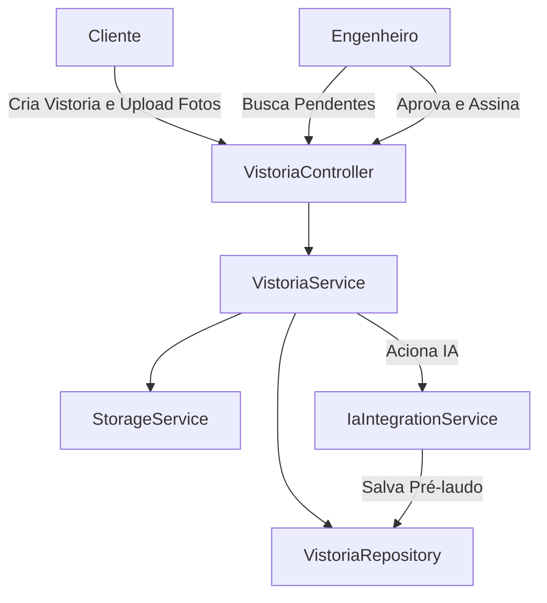

# Gestão de Vistorias Design

**Spec**: `.specs/features/gestao-vistorias/spec.md`
**Status**: Draft

---

## Architecture Overview

O módulo centraliza-se na entidade `Vistoria`, que funciona como uma máquina de estados (`VistoriaStatus`).
A comunicação com a IA será feita de forma isolada através de um serviço (`IaIntegrationService`), preparando o terreno para filas assíncronas no futuro, mas mantendo a simplicidade no MVP.

---

## Code Reuse Analysis

### Existing Components to Leverage

| Component | Location | How to Use |
| --- | --- | --- |
| `StorageService` | `src/main/java/br/com/vistoriapredial/storage/` | Para persistir as fotos enviadas (`LocalStorageService`). |
| `Usuario` | `src/main/java/br/com/vistoriapredial/usuario/` | Para vincular o Cliente e o Engenheiro à vistoria. |
| `GlobalExceptionHandler` | `src/main/java/br/com/vistoriapredial/shared/` | Para tratar os erros 400, 404 e 409 usando a RFC 9457 já configurada. |

---

## Components

### `Vistoria` (Entity) & `VistoriaStatus` (Enum)
- **Purpose**: Entidade raiz que armazena dados, status, pré-laudo da IA e assinaturas.
- **Location**: `src/main/java/br/com/vistoriapredial/vistoria/domain/`

### `ImagemVistoria` (Entity)
- **Purpose**: Armazena a referência (path/URL) da imagem no storage local, vinculada a um item do protocolo.
- **Location**: `src/main/java/br/com/vistoriapredial/vistoria/domain/`

### `VistoriaController`
- **Purpose**: Endpoints da API REST para clientes (upload/submissão) e engenheiros (revisão/aprovação).
- **Location**: `src/main/java/br/com/vistoriapredial/vistoria/web/`
- **Interfaces**:
  - `POST /api/vistorias` (Cria vistoria)
  - `POST /api/vistorias/{id}/imagens` (Upload de fotos)
  - `POST /api/vistorias/{id}/submeter` (Finaliza envio, chama IA)
  - `GET /api/vistorias/pendentes` (Para engenheiros)
  - `POST /api/vistorias/{id}/aprovar` (Assinatura do engenheiro)

### `VistoriaService`
- **Purpose**: Orquestra a máquina de estados, regras de negócio e chama o Storage e IA.
- **Location**: `src/main/java/br/com/vistoriapredial/vistoria/application/`

### `IaIntegrationService`
- **Purpose**: Mock/Interface para abstrair a chamada real para a Oracle GenAI / OpenAI.
- **Location**: `src/main/java/br/com/vistoriapredial/vistoria/application/`

---

## Error Handling Strategy

| Error Scenario | Handling | User Impact |
| --- | --- | --- |
| Vistoria não está em rascunho | Lançar `IllegalStateException` -> 409 Conflict | Recebe aviso que a vistoria não pode ser alterada. |
| Upload sem arquivo | Validação Multipart -> 400 Bad Request | Recebe erro de validação. |
| IA falha/timeout | Capturar exceção, setar status `FALHA_IA` | Vistoria fica pausada, cliente vê "Falha ao analisar" no app. |

---

## Risks & Concerns

| Concern | Location | Impact | Mitigation |
| --- | --- | --- | --- |
| Upload de grandes arquivos síncrono | `VistoriaController` | Ocupar threads e memória. | Limitar o tamanho do `MultipartFile` na configuração do Spring e usar streaming direto pro Storage. |
| Chamada da IA trava a thread | `VistoriaService` | Gargalo na API se a IA demorar > 30s. | No MVP a chamada será na mesma thread (síncrono bloqueante) usando `RestClient`, mas com timeout configurado. Futuramente usar `@Async` ou Message Broker. |
