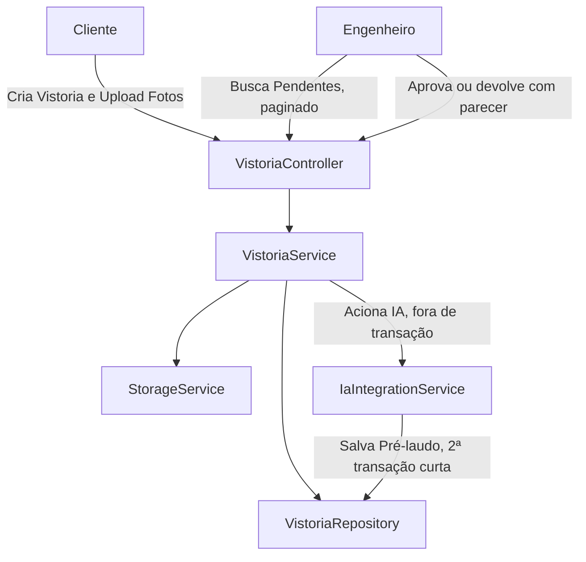

# Gestão de Vistorias Design

**Spec**: `.specs/features/gestao-vistorias/spec.md`
**Status**: Implementado (revalidado em 2026-09-19 contra o código e os testes executados)

---

## Architecture Overview

O módulo centraliza-se na entidade `Vistoria`, que funciona como uma máquina de estados (`VistoriaStatus`).
A comunicação com a IA é feita de forma isolada através de uma porta (`IaIntegrationService`), hoje resolvida
por `MockIaIntegrationService`. A chamada à IA roda fora de transação de banco — ver "Transação da submissão"
abaixo — preparando o terreno para uma integração real (síncrona ou não) sem redesenhar o fluxo.

---

## Code Reuse Analysis

### Existing Components to Leverage

| Component | Location | How to Use |
| --- | --- | --- |
| `StorageService` | `src/main/java/br/com/vistoriapredial/storage/` | Para persistir as fotos enviadas (`LocalStorageService`). |
| `Usuario` | `src/main/java/br/com/vistoriapredial/usuario/` | Para vincular o Cliente e o Engenheiro à vistoria. |
| `GlobalExceptionHandler` | `src/main/java/br/com/vistoriapredial/shared/` | Traduz as exceções da feature (ver tabela de erros abaixo) para `ProblemDetail` RFC 9457. |
| `TransactionTemplate` | `src/main/java/br/com/vistoriapredial/config/TransactionTemplateConfig.java` | Duas transações curtas em `submeterVistoria`, uma antes e outra depois da chamada de IA. |

---

## Components

### `Vistoria` (Entity) & `VistoriaStatus` (Enum)
- **Purpose**: Entidade raiz que armazena dados, status, pré-laudo da IA e parecer do engenheiro. Usa `@Version` para controle otimista.
- **Location**: `src/main/java/br/com/vistoriapredial/vistoria/domain/`

### `ImagemVistoria` (Entity)
- **Purpose**: Armazena a referência (path relativo) da imagem no storage, vinculada a um item do protocolo (`ProtocoloVistoria`).
- **Location**: `src/main/java/br/com/vistoriapredial/vistoria/domain/`

### `VistoriaController`
- **Purpose**: Endpoints da API REST para clientes (criação/upload/submissão) e engenheiros (fila/decisão).
- **Location**: `src/main/java/br/com/vistoriapredial/vistoria/web/`
- **Interfaces** (prefixo `/api/vistorias`, conferido contra `VistoriaController.java`):
  - `POST /` — cria vistoria (`ROLE_CLIENTE`)
  - `GET /minhas?page=&size=` — lista as vistorias do cliente, paginada (`PaginaResponseDto`)
  - `GET /{id}` — busca uma vistoria específica, autorização por recurso (`ROLE_CLIENTE` dono ou `ROLE_ENGENHEIRO` enquanto `AGUARDANDO_ENGENHEIRO`)
  - `POST /{id}/imagens` — upload de evidência multipart (`ROLE_CLIENTE`)
  - `POST /{id}/submeter` — finaliza envio, aciona a IA (`ROLE_CLIENTE`)
  - `GET /{vistoriaId}/imagens/{imagemId}/conteudo` — conteúdo da evidência, autorização por recurso
  - `GET /pendentes?page=&size=` — fila técnica, paginada (`ROLE_ENGENHEIRO`)
  - `POST /{id}/analisar` — aprova ou devolve com parecer (`ROLE_ENGENHEIRO`)

### `VistoriaService`
- **Purpose**: Orquestra a máquina de estados, autorização por recurso e chamadas a `StorageService`/`IaIntegrationService`.
- **Location**: `src/main/java/br/com/vistoriapredial/vistoria/application/`
- **Detalhe relevante**: `submeterVistoria` não é `@Transactional` como um todo — usa `TransactionTemplate` para abrir e fechar duas transações curtas, deixando a chamada de IA fora de qualquer transação (ver ADR em `docs/architecture.md`, seção 6).
- **Paginação**: o controller preserva `page` e `size`, mas fixa `dataCriacao DESC, id DESC` e ignora `sort` externo. `listarVistoriasCliente`/`listarPendentesEngenharia` buscam a página sem `@EntityGraph` (evita paginação em memória) e recarregam `imagens` da página em lote via `findByIdIn`.
- **Índices**: a V6 adiciona `(cliente_id, data_criacao DESC, id DESC)` e `(status, data_criacao DESC, id DESC)`, alinhados aos filtros e à ordenação das listagens.

### `IaIntegrationService`
- **Purpose**: Porta que abstrai a geração do pré-laudo. `MockIaIntegrationService` é o único adaptador ativo nesta versão; a integração real com OCI Generative AI está fora do escopo desta feature — ver `.specs/features/integracao-oci/`.
- **Location**: `src/main/java/br/com/vistoriapredial/vistoria/application/`

---

## Error Handling Strategy

| Error Scenario | Exceção | Status | User Impact |
| --- | --- | --- | --- |
| Vistoria não encontrada | `VistoriaNotFoundException` | 404 | Recurso inexistente. |
| Vistoria de outro cliente / engenheiro fora do momento certo | `VistoriaAccessDeniedException` / `StaleInspectionException` | 403 / 409 | Acesso negado ou vistoria não está mais disponível para a operação. |
| Evidência inexistente / de outra vistoria | `EvidenceNotFoundException` | 404 | Recurso inexistente. |
| Evidência de outro cliente, ou engenheiro fora de `AGUARDANDO_ENGENHEIRO` | `EvidenceAccessDeniedException` / `StaleInspectionException` | 403 / 409 | Acesso negado ou vistoria não está mais disponível. |
| Upload sem arquivo, tipo não suportado, protocolo inválido | `InvalidEvidenceException` | 422 | Erro de validação com detalhe do motivo. |
| IA falha ou lança exceção | Capturada em `submeterVistoria`, loga com `LOGGER.warn` e seta status `FALHA_IA` | 200 (na resposta do submeter) | Vistoria fica em `FALHA_IA`; cliente pode reenviar o mesmo caso. |

---

## Risks & Concerns

| Concern | Location | Impact | Mitigation |
| --- | --- | --- | --- |
| Upload de grandes arquivos síncrono | `VistoriaController` | Ocupar threads e memória. | `spring.servlet.multipart.max-file-size=10MB` já configurado; `EvidenceFileValidator` valida tamanho antes de gravar. |
| Chamada da IA trava a thread | `VistoriaService` | Gargalo se a IA demorar. | Resolvido: a chamada roda fora de transação (`TransactionTemplate`), então não segura conexão de banco. O tempo de resposta HTTP ainda depende da IA ser síncrona — se a integração real (`.specs/features/integracao-oci/`) vier assíncrona, o frontend já tem polling para refletir a conclusão sem bloquear a requisição. |
| `@EntityGraph` de coleção junto com `Pageable` | `VistoriaRepository` | Faria o Hibernate paginar em memória, anulando os índices de paginação. | Resolvido: buscas paginadas não usam `@EntityGraph`; `imagens` da página é recarregado em lote via `findByIdIn`. |
