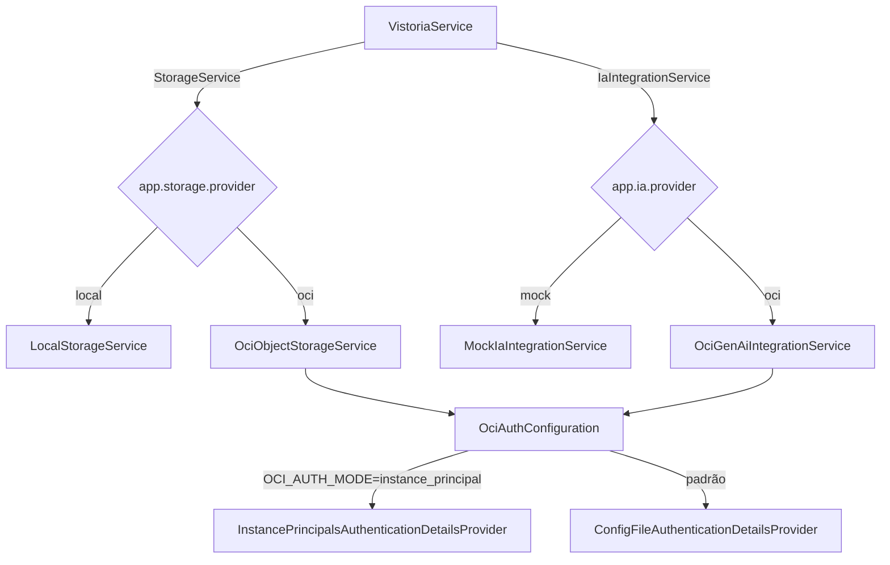

# Integração OCI Design

**Spec**: `.specs/features/integracao-oci/spec.md`
**Status**: Draft — implementação ainda não iniciada nesta revisão

---

## Architecture Overview

Um pacote novo, `integration/oci/`, concentra os adaptadores e a configuração de autenticação — consistente com a arquitetura-alvo já descrita em `AGENTS.md` (`integration/<provider>/` para clientes de serviços externos). Nenhuma classe fora desse pacote muda: `VistoriaService`, `VistoriaController` e os DTOs continuam falando só com `StorageService` e `IaIntegrationService`.

---

## Code Reuse Analysis

| Component | Location | How to Use |
| --- | --- | --- |
| `StorageService` | `storage/StorageService.java` | Interface já correta; `OciObjectStorageService` implementa sem mudar a assinatura. |
| `IaIntegrationService` | `vistoria/application/IaIntegrationService.java` | Interface já correta; `OciGenAiIntegrationService` implementa sem mudar a assinatura. |
| `StorageException` | `storage/StorageException.java` | Reaproveitada para traduzir falhas do Object Storage — `VistoriaService.uploadImagem` já trata essa exceção e compensa a falha de persistência. |

---

## Components

### `OciAuthConfiguration`
- **Purpose**: Único ponto de decisão de autenticação com o SDK da OCI. Nenhum adaptador decide sozinho qual provider usar.
- **Location**: `src/main/java/br/com/vistoriapredial/integration/oci/OciAuthConfiguration.java`
- **Regra**: se `OCI_AUTH_MODE=instance_principal` (setado pelo Ansible só na VM), expõe `InstancePrincipalsAuthenticationDetailsProvider`; caso contrário, `ConfigFileAuthenticationDetailsProvider` lendo `~/.oci/config` (montado como volume só leitura em dev).

### `OciObjectStorageService implements StorageService`
- **Location**: `src/main/java/br/com/vistoriapredial/integration/oci/OciObjectStorageService.java`
- **Purpose**: `store`/`load`/`delete` contra o bucket configurado (`OCI_BUCKET_NAME`), usando o provider de `OciAuthConfiguration`.
- **Ativação**: `app.storage.provider=oci` (default continua `local`).

### `OciGenAiIntegrationService implements IaIntegrationService`
- **Location**: `src/main/java/br/com/vistoriapredial/integration/oci/OciGenAiIntegrationService.java`
- **Purpose**: para cada URL de imagem, monta uma chamada multimodal ao modelo vigente (`GENAI_MODEL_ID`), guarda o JSON estruturado devolvido e junta os achados de todas as fotos num texto final — feito em código, sem uma segunda chamada de IA (decisão registrada no spec).
- **Ativação**: `app.ia.provider=oci` (default continua `mock`).
- **Timeout**: usa `oci.genai.connect-timeout-ms`/`oci.genai.read-timeout-ms`, já existentes em `application.properties`.

---

## Error Handling Strategy

| Error Scenario | Handling | User Impact |
| --- | --- | --- |
| Object Storage indisponível ou credencial inválida | `OciObjectStorageService` traduz para `StorageException` | Mesmo comportamento hoje: `uploadImagem` remove a evidência e propaga o erro. |
| OCI Generative AI retorna `429` (limite da conta trial) | Tratado como falha de IA recuperável dentro de `submeterVistoria` | Vistoria cai em `FALHA_IA`; cliente pode reenviar. |
| OCI Generative AI retorna `404` (modelo descontinuado) | Logado como erro explícito, não silencioso | Vistoria cai em `FALHA_IA`; time precisa atualizar `GENAI_MODEL_ID`. |
| `OCI_AUTH_MODE` ausente e `~/.oci/config` inacessível | Falha no boot da aplicação, mensagem clara | Mesmo espírito da validação atual de `JWT_SECRET`. |

---

## Migração de banco (PostgreSQL → Oracle Autonomous DB)

Fora do pacote `integration/oci/`, mas parte desta feature:

- Trocar `org.postgresql:postgresql` pelo driver JDBC da Oracle.
- Trocar `flyway-database-postgresql` pelo módulo Oracle do Flyway — **confirmar antes se o suporte está disponível na edição em uso do Flyway**.
- `V2__create_vistoria_schema.sql` já usa `GENERATED BY DEFAULT AS IDENTITY` (compatível com Oracle 12c+); não precisa de correção nesse ponto, ao contrário do que uma versão anterior da spec do time (`infra/docs/spec-backend.md`) presumia — checar sempre contra o arquivo real antes de assumir uma migration antiga como incompatível.
- Trocar colunas `TEXT` (`pre_laudo_ia`, `parecer_engenheiro`) por `CLOB`.
- Testes de integração: trocar o Testcontainers de `postgresql` pela imagem Oracle, ou manter H2 nos testes que não validam SQL específico de dialeto.

---

## Pendência a validar antes de implementar

Não há confirmação de primeira mão do formato exato de request/response multimodal da OCI para o modelo vigente (como a imagem é codificada no payload, limite de tamanho). Antes de escrever `OciGenAiIntegrationService`, rodar um teste isolado (fora do Spring Boot, usando os scripts de `infra/scripts/smoke-tests/`) contra o endpoint real.

---

## Risks & Concerns

| Concern | Impact | Mitigation |
| --- | --- | --- |
| Conta trial com Generative AI bloqueado (limite de request/min = 0) | Bloqueia validar `OciGenAiIntegrationService` contra o serviço real | Desenvolver e testar com mock; só validar contra o serviço real quando o limite for liberado. Não bloquear o resto da feature por isso. |
| VM (Ampere A1) sem capacidade disponível na região | Sem VM não há ambiente de produção para implantar | Fora do controle desta feature; acompanhar o repositório `infra` para status de provisionamento. |
| Modelo `GENAI_MODEL_ID` pode ser aposentado sem aviso | Chamadas passam a retornar `404` | Não fixar o OCID do modelo em código; manter como variável de ambiente e documentar o procedimento de redescoberta (`list_available_models.py`). |
