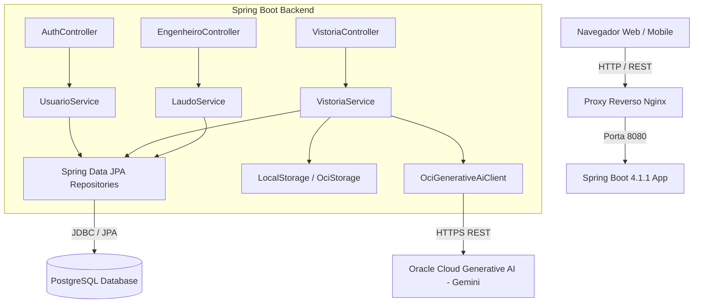
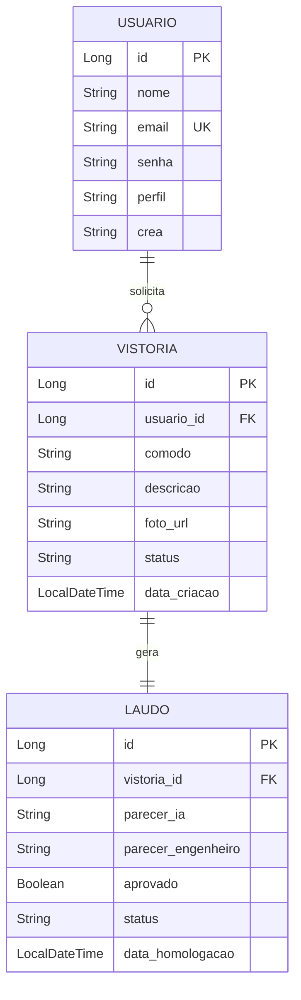

# Vistoria Predial com IA Multimodal Design

**Spec**: `.specs/features/vistoria-predial/spec.md`
**Status**: Draft

---

## Architecture Overview

A solução adota o padrão **Monólito Modular** em Spring Boot 4.1.1 com Java 21, dividida em camadas lógicas limpas (Controller, Service, Repository, DTO, Integration) e servindo um frontend responsivo em Vanilla HTML5/CSS3/JS.



---

## Code Reuse Analysis

### Existing Components to Leverage

| Component | Location | How to Use |
| --------- | -------- | ---------- |
| Spring Boot Starters | `pom.xml` (`spring-boot-starter-web`, `data-jpa`, `validation`, `security`) | Base do framework sem dependências de terceiros |
| RestClient Nativo | `org.springframework.web.client.RestClient` | Comunicação HTTP fluente com a API do OCI |
| Records Java 21 | `java.lang.Record` | DTOs imutáveis para requests e responses |

---

## Components and Interfaces

### 1. `AuthController` & `UsuarioService`
* **Local:** `br.com.vistoriapredial.controller.AuthController`
* **Responsabilidade:** Registro e autenticação de usuários (Cliente e Engenheiro), emissão de JWT.
* **Interfaces:**
  - `POST /api/auth/register` (Cria novo usuário)
  - `POST /api/auth/login` (Autentica e devolve token + role)

### 2. `VistoriaController` & `VistoriaService`
* **Local:** `br.com.vistoriapredial.controller.VistoriaController`
* **Responsabilidade:** Recebimento de uploads de fotos, validação de arquivo, orquestração com OCI e persistência do pré-laudo.
* **Interfaces:**
  - `POST /api/vistorias` (Multipart: cômodo, descrição, arquivo de foto)
  - `GET /api/vistorias` (Lista vistorias do usuário autenticado)
  - `GET /api/vistorias/{id}` (Detalhes e laudo de uma vistoria específica)

### 3. `EngenheiroController` & `LaudoService`
* **Local:** `br.com.vistoriapredial.controller.EngenheiroController`
* **Responsabilidade:** Auditoria técnica, fila de vistorias pendentes e homologação com assinatura de CREA.
* **Interfaces:**
  - `GET /api/engenheiro/vistorias/pendentes` (Lista vistorias com status `PRE_LAUDO_GERADO`)
  - `POST /api/engenheiro/vistorias/{id}/homologar` (Payload: texto revisado, aprovação sim/não, número de CREA)

### 4. `OciGenerativeAiClient`
* **Local:** `br.com.vistoriapredial.integration.oci.OciGenerativeAiClient`
* **Responsabilidade:** Encapsular o payload multimodal (imagem em base64 + System Prompt de Engenharia Civil) e despachar para o endpoint da Oracle Cloud.

---

## Data Models



### Definição das Tabelas
* **`tb_usuario`**: `id` (BIGSERIAL), `nome` (VARCHAR), `email` (VARCHAR UNIQUE), `senha` (VARCHAR), `perfil` (`ROLE_CLIENTE`, `ROLE_ENGENHEIRO`), `crea` (VARCHAR, opcional).
* **`tb_vistoria`**: `id` (BIGSERIAL), `usuario_id` (FK), `comodo` (VARCHAR), `descricao` (TEXT), `foto_url` (VARCHAR), `status` (`RECEBIDO`, `EM_ANALISE`, `PRE_LAUDO_GERADO`, `CONCLUIDA`, `ERRO`), `data_criacao` (TIMESTAMP).
* **`tb_laudo`**: `id` (BIGSERIAL), `vistoria_id` (FK), `parecer_ia` (TEXT), `parecer_engenheiro` (TEXT), `aprovado` (BOOLEAN), `status` (`PRELIMINAR`, `HOMOLOGADO`), `data_homologacao` (TIMESTAMP).

---

## REST API Contracts

### Autenticação
```http
POST /api/auth/login
Content-Type: application/json

{
  "email": "cliente@email.com",
  "senha": "senhaSegura123"
}

Response 200 OK:
{
  "token": "eyJhbGciOi...",
  "nome": "Vinicius",
  "email": "cliente@email.com",
  "perfil": "ROLE_CLIENTE"
}
```

### Envio de Vistoria
```http
POST /api/vistorias
Authorization: Bearer eyJ...
Content-Type: multipart/form-data

foto: [arquivo binário .jpg/.png]
comodo: "Cozinha"
descricao: "Foto do azulejo próximo à pia com desnível visível"

Response 201 Created:
{
  "id": 1,
  "status": "PRE_LAUDO_GERADO",
  "comodo": "Cozinha",
  "fotoUrl": "/uploads/1_cozinha.jpg",
  "preLaudo": {
    "parecerIa": "Identificado desaprumo no assentamento cerâmico e falha de rejunte com risco de infiltração. Recomendação: Retrabalho de vedação conforme NBR 13753.",
    "aprovado": false
  }
}
```

### Homologação pelo Engenheiro
```http
POST /api/engenheiro/vistorias/1/homologar
Authorization: Bearer eyJ...
Content-Type: application/json

{
  "parecerEngenheiro": "Concordo com o laudo da IA. Vício construtivo aparente confirmado. Notificar construtora para reparo antes da entrega das chaves.",
  "aprovado": false,
  "crea": "123456/SP"
}

Response 200 OK:
{
  "vistoriaId": 1,
  "status": "CONCLUIDA",
  "laudoStatus": "HOMOLOGADO",
  "dataHomologacao": "2026-09-18T23:30:00"
}
```

---

## Tech Decisions

| ID | Decision | Alternative | Rationale |
| -- | -------- | ----------- | --------- |
| TD-01 | Storage Local em Dev com interface `StorageService` | Salvar direto na OCI | Permite rodar o projeto localmente sem credenciais da Oracle Cloud ativas no desenvolvimento |
| TD-02 | Autenticação stateless via JWT | Session baseada em Cookie | Desacopla o frontend Vanilla e facilita consumo mobile |
| TD-03 | Mock configurável para OCI Generative AI | Chamar OCI em todos os testes | Evita custos de API e dependência de rede durante suíte de testes automatizados |

---

## Risks & Concerns

| Risk | Impact | Mitigation |
| ---- | ------ | ---------- |
| Timeout na chamada da API da Oracle | Vistoria fica travada em `EM_ANALISE` | Configurar timeout explícito no `RestClient` (10s) e marcar vistoria com `ERRO_PROCESSAMENTO` permitindo retry |
| Envio de fotos gigantescas (>20MB) | Falta de memória na VM | Limitar `spring.servlet.multipart.max-file-size=10MB` com filtro de rejeição no Spring Boot |
| Custos inesperados da IA da Oracle | Estourar a cota gratuita | Utilizar prompt suscinto limitando `max_tokens` de saída para 1000 tokens |
