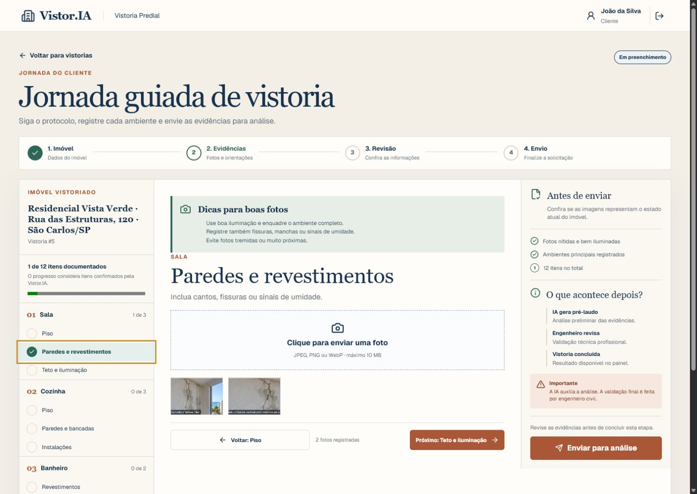

# Vistor.IA


## O que o projeto faz

Vistor.IA organiza vistorias prediais em uma jornada de duas pontas. O cliente cadastra o imóvel, registra evidências por um protocolo de 12 itens e acompanha o andamento; o engenheiro civil revisa as imagens, avalia o pré-laudo e decide se aprova a vistoria ou solicita complementação.

O sistema preserva o modelo *Human-in-the-Loop*: a análise automatizada é preliminar e a decisão permanece com o profissional de engenharia. Nesta versão, o gerador de pré-laudo é um adaptador mockado e não realiza chamadas pagas ou externas.

## Funcionalidades

- ✅ Cadastro e login com JWT; perfis de engenharia exigem convite configurado
- ✅ Proteção de rotas por perfil (`ROLE_CLIENTE` e `ROLE_ENGENHEIRO`)
- ✅ Proteção contra criação concorrente de rascunhos na mesma tela
- ✅ Protocolo guiado com 5 grupos e 12 itens de evidência
- ✅ Upload validado de imagens JPEG, PNG e WebP de até 10 MB
- ✅ Persistência das evidências atrás da abstração `StorageService`
- ✅ Acesso autenticado às imagens, restrito ao proprietário ou à revisão técnica
- ✅ Pré-laudo mockado e explicitamente identificado como análise preliminar
- ✅ Fila técnica para engenheiros, com devolução ou aprovação mediante parecer
- ✅ Complementação e reenvio pelo cliente sem criar outra vistoria
- ✅ Respostas de erro em `application/problem+json` (RFC 9457)
- ✅ Interface responsiva para cliente e engenharia

## Interface

### Jornada do cliente



### Revisão do engenheiro


## Tecnologias

| Tecnologia | Versão | Responsabilidade |
| --- | --- | --- |
| Java | 21 | Linguagem do backend |
| Spring Boot | 3.2.3 | API REST, injeção de dependências e configuração |
| Spring Security + JJWT | 6.x / 0.12.6 | Autenticação stateless e autorização por perfil |
| Spring Data JPA | 3.2.x | Persistência e consultas |
| Flyway | 9.22.x + módulo PostgreSQL 10.8.1 | Evolução versionada do schema |
| PostgreSQL | 16 no teste de integração | Banco-alvo |
| H2 | gerenciado pelo Spring Boot | Execução local rápida e parte dos testes |
| Next.js | 16.3.5 | Frontend React com App Router |
| React | 19.2.8 | Componentes e estado da interface |
| TypeScript | 5.x | Contratos e segurança de tipos no frontend |
| Vitest | 4.1.11 | Testes unitários e de componentes do frontend |
| JUnit 5, Mockito e Testcontainers | gerenciados pelo Maven | Testes unitários e integrados do backend |

## Arquitetura

O backend segue um monólito modular por feature. A borda HTTP delega para casos de uso, entidades não são expostas nos contratos e integrações de infraestrutura ficam atrás de abstrações.

```text
src/main/java/br/com/vistoriapredial/
├── usuario/
│   ├── domain/                 # Usuário, perfis e invariantes
│   ├── persistence/            # Repository da feature
│   ├── application/            # Cadastro, login, DTOs e exceções
│   └── web/                    # Endpoints de autenticação
├── vistoria/
│   ├── domain/                 # Vistoria, imagens e estados
│   ├── persistence/            # Repositories de vistoria e evidências
│   ├── application/            # Protocolo, validação e fluxo Human-in-the-Loop
│   └── web/                    # Contratos e endpoints da vistoria
├── storage/                    # Porta e adaptador de armazenamento local
├── config/security/            # JWT, CORS e cadeia do Spring Security
└── shared/web/error/           # ProblemDetail e tratamento RFC 9457

frontend/src/
├── app/                        # Rotas públicas e áreas cliente/engenharia
├── components/                 # Shell e componentes transversais
├── features/auth/              # Sessão, formulários e proteção de perfil
├── features/inspections/       # Jornadas de cliente e engenheiro
└── lib/                        # Cliente HTTP e sessão tipada
```

O detalhamento das fronteiras e do fluxo está em [`docs/architecture.md`](docs/architecture.md).

## Como rodar

### Pré-requisitos

- Java 21
- Node.js 20+
- Docker ativo somente para o teste de integração com PostgreSQL

### Desenvolvimento local, sem Docker

O perfil padrão usa H2 em memória e armazenamento local em `uploads/`.

```powershell
# terminal 1 — backend em http://localhost:8080
$env:JWT_SECRET = "defina-um-segredo-local-com-pelo-menos-32-bytes"
$env:ENGINEER_REGISTRATION_CODE = "defina-um-convite-para-engenheiros"
.\mvnw.cmd spring-boot:run

# terminal 2 — frontend em http://localhost:3000
cd frontend
npm ci
npm run dev
```

O frontend usa `http://localhost:8080/api` por padrão. Para outra API:

```powershell
$env:NEXT_PUBLIC_API_URL = "https://api.exemplo.com/api"
npm run build
```

### Frontend com Docker

O repositório contém uma imagem *standalone* para o frontend. O backend deve estar acessível pela URL definida no momento do build.

```powershell
docker build --build-arg NEXT_PUBLIC_API_URL=http://localhost:8080/api -t vistoria-predial-frontend .\frontend
docker run --rm -p 3000:3000 vistoria-predial-frontend
```

Não há `docker-compose` do ambiente completo nesta versão. Para usar PostgreSQL no backend, configure `DB_URL`, `DB_USERNAME`, `DB_PASSWORD`, `DB_DRIVER` e `JPA_PLATFORM` antes de iniciar a aplicação. O backend exige `JWT_SECRET` com pelo menos 32 bytes em todos os ambientes; não reutilize o valor local em produção. Configure `ENGINEER_REGISTRATION_CODE` para habilitar o cadastro de engenheiros.

## Endpoints principais

Todas as rotas da aplicação usam o prefixo `/api`.

| Método | Endpoint | Perfil | Descrição |
| --- | --- | --- | --- |
| `POST` | `/api/auth/register` | Público | Cadastra cliente; engenheiro exige convite válido |
| `POST` | `/api/auth/login` | Público | Autentica e retorna JWT |
| `POST` | `/api/vistorias` | Cliente | Cria rascunho com endereço |
| `GET` | `/api/vistorias/minhas` | Cliente | Lista as vistorias do usuário, paginada (`?page=&size=`) |
| `GET` | `/api/vistorias/{id}` | Cliente/Engenheiro | Busca uma vistoria específica, com autorização por recurso |
| `POST` | `/api/vistorias/{id}/imagens` | Cliente | Envia evidência multipart |
| `POST` | `/api/vistorias/{id}/submeter` | Cliente | Envia ou reenvia para análise |
| `GET` | `/api/vistorias/{id}/imagens/{imagemId}/conteudo` | Cliente/Engenheiro | Entrega evidência com autorização por recurso |
| `GET` | `/api/vistorias/pendentes` | Engenheiro | Lista a fila técnica, paginada (`?page=&size=`) |
| `POST` | `/api/vistorias/{id}/analisar` | Engenheiro | Aprova ou devolve com parecer |

As listagens (`/minhas` e `/pendentes`) retornam um envelope de paginação:

```json
{
  "content": [ /* vistorias da página */ ],
  "pagina": 0,
  "tamanho": 10,
  "totalElementos": 23,
  "totalPaginas": 3
}
```

### Exemplo: cadastro de cliente

```bash
curl -X POST http://localhost:8080/api/auth/register \
  -H "Content-Type: application/json" \
  -d '{
    "nome": "Cliente Exemplo",
    "email": "cliente@example.com",
    "senha": "Senha123!",
    "perfil": "ROLE_CLIENTE"
  }'
```

Resposta resumida:

```json
{
  "token": "<jwt>",
  "tipo": "Bearer",
  "usuarioId": 1,
  "nome": "Cliente Exemplo",
  "perfil": "ROLE_CLIENTE"
}
```

No cadastro de engenheiro, envie também `"crea"` e `"codigoConvite"`; o segundo valor deve corresponder a `ENGINEER_REGISTRATION_CODE`.

### Exemplo: criar uma vistoria

```bash
curl -X POST http://localhost:8080/api/vistorias \
  -H "Authorization: Bearer <jwt>" \
  -H "Content-Type: application/json" \
  -d '{"endereco":"Rua das Estruturas, 120 - São Carlos/SP"}'
```

### Exemplo: enviar uma evidência

```bash
curl -X POST http://localhost:8080/api/vistorias/1/imagens \
  -H "Authorization: Bearer <jwt>" \
  -F "protocoloItem=SALA_PISO" \
  -F "file=@evidencia.png;type=image/png"
```

Erros de validação, autenticação, autorização e conflito usam `application/problem+json`.

## Testes e gates

```powershell
# backend — inclui testes unitários, MVC, segurança, contexto e PostgreSQL real
.\mvnw.cmd test

# frontend
cd frontend
npm test -- --run
npm run lint
npm run build
```

A suíte de backend usa Testcontainers; o teste PostgreSQL requer Docker disponível.

## Decisões e desafios técnicos

- **Human-in-the-Loop explícito:** o pré-laudo não aprova a vistoria. A transição final exige parecer e ação de um engenheiro.
- **Autorização por recurso:** proteger a rota não basta; o serviço confirma ownership ou atribuição antes de entregar cada imagem.
- **Uploads não confiáveis:** extensão e `Content-Type` não são aceitos isoladamente. O backend valida tamanho, MIME, assinatura e nome gerado pelo servidor.
- **Consistência entre arquivo e banco:** a gravação força o flush da evidência e remove o arquivo armazenado quando a persistência falha.
- **Concorrência de revisão:** a entidade de vistoria usa versão otimista e conflitos conhecidos retornam `409`.
- **Sessão durante hidratação:** a área protegida diferencia o snapshot do servidor e o do navegador para não expulsar uma sessão válida após recarga.
- **Portabilidade do schema:** as migrations são verificadas também em PostgreSQL real; H2 isoladamente não é usado como prova de compatibilidade.
- **Erros previsíveis:** a API padroniza falhas com `ProblemDetail` e mantém o mesmo contrato na cadeia de segurança.
- **Credenciais sem fallback público:** o backend falha ao iniciar sem um segredo JWT forte; o cadastro de engenheiros só é liberado por convite configurado.

## Limites atuais

- A integração OCI está representada apenas por propriedades e por uma porta de aplicação; o adaptador ativo de pré-laudo é mockado.
- O armazenamento ativo é local. A abstração permite trocar o adaptador, mas não existe integração com S3/OCI Object Storage nesta versão.
- O convite de engenharia é um controle administrativo do MVP, não uma validação automática do CREA; antes de abertura pública, o onboarding profissional deve ganhar verificação e gestão próprias.
- O repositório não declara uma licença de uso.
