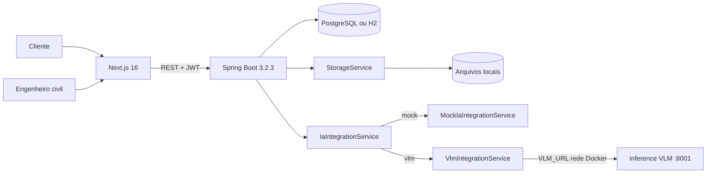

# Arquitetura do Vistor.IA

## 1. Visão geral

O Vistor.IA combina um frontend Next.js com uma API Java/Spring Boot. O backend segue um monólito modular por feature: autenticação e vistoria compartilham o mesmo processo, mas mantêm domínio, aplicação, persistência e borda HTTP separados.

O banco-alvo é PostgreSQL e o desenvolvimento local pode usar H2. Flyway é a fonte do schema. O armazenamento de imagens é local nesta versão, atrás da porta `StorageService`.

## 2. Contêineres e dependências

No protótipo, o repositório sobe o programa e a IA juntos no mesmo `docker-compose.yml`, em **containers separados**:

| Serviço | Porta | Papel |
| --- | --- | --- |
| `frontend` | 3000 | Next.js |
| `backend` | 8080 | Spring Boot |
| `inference` | 8001 | FastAPI + VLM (pré-laudo) |



`IaIntegrationService` é a porta de pré-análise. Com `app.ia.provider=mock` usa `MockIaIntegrationService`; com `vlm` (default no compose) usa `VlmIntegrationService` contra o container `inference` (`VLM_URL=http://inference:8001` + `VLM_API_KEY`). O código da VLM fica em `inference/` neste repositório.

## 3. Fronteiras do backend

```text
br.com.vistoriapredial/
├── usuario/
│   ├── domain/       # Usuário e perfis
│   ├── persistence/  # UsuarioRepository
│   ├── application/  # Cadastro, autenticação e contratos
│   └── web/          # AuthController
├── vistoria/
│   ├── domain/       # Agregado, evidências e estados
│   ├── persistence/  # Repositories JPA
│   ├── application/  # Casos de uso, protocolo e porta de IA
│   └── web/          # VistoriaController e DTOs HTTP
├── storage/          # Porta e adaptador local de arquivos
├── config/security/  # JWT, CORS e autorização por rota
└── shared/web/error/ # Contrato RFC 9457
```

- `web` adapta HTTP e delega para `application`.
- `application` coordena domínio, persistência, armazenamento e pré-análise.
- `domain` concentra estado e transições da vistoria.
- O acesso às evidências combina autorização de rota e autorização por recurso.

## 4. Frontend

O App Router separa rotas públicas de autenticação e áreas protegidas por perfil. A camada `features/inspections` contém os dois fluxos sem duplicar o contrato HTTP:

- cliente: painel, criação, protocolo, upload, submissão e acompanhamento;
- engenharia: fila, evidências, pré-laudo e decisão técnica;
- compartilhado: tipos, status, protocolo e carregamento autenticado de imagens.

O cliente HTTP aceita JSON, `FormData` e blobs, traduz erros RFC 9457 e expira a sessão em respostas `401` autenticadas.

## 5. Fluxo Human-in-the-Loop

1. O cliente se cadastra livremente; o engenheiro precisa do convite configurado no ambiente. Após o cadastro, ambos recebem um JWT.
2. O cliente cria uma vistoria em `EM_RASCUNHO` e envia evidências associadas aos 12 itens do protocolo.
3. Ao submeter, o serviço exige ao menos uma evidência e executa a porta de IA.
4. O mock gera um pré-laudo e a vistoria passa para `AGUARDANDO_ENGENHEIRO`.
5. O engenheiro registra parecer e devolve (`DEVOLVIDA_CLIENTE`) ou aprova (`CONCLUIDA`).
6. Uma devolução pode receber novas evidências e ser reenviada para a mesma vistoria.

Falhas de pré-análise permanecem explícitas em `FALHA_IA`; o sistema não fabrica sucesso após uma exceção.

## 6. Consistência e segurança

- JWT stateless e perfis negados por padrão na cadeia de segurança.
- Segredo JWT obrigatório com no mínimo 32 bytes e sem fallback versionado.
- Elevação para o perfil de engenheiro protegida por convite comparado em tempo constante.
- `ProblemDetail` para validação, autenticação, autorização, ausência e conflito.
- Validação de tamanho, MIME e assinatura antes de persistir imagens.
- Nome físico gerado pelo servidor e caminho mantido fora do contrato HTTP.
- `@Version` na vistoria para detectar decisões concorrentes.
- `Cache-Control: private, no-store` no conteúdo autenticado das evidências.
- Falha ao persistir a evidência aciona a remoção compensatória do arquivo já armazenado.
- `/vistorias/minhas` e `/vistorias/pendentes` são paginadas (`PaginaResponseDto`); a página é buscada sem `@EntityGraph` e as imagens da página são recarregadas em uma segunda consulta por lote de ids, evitando tanto paginação em memória (fetch join de coleção + `Pageable`) quanto N+1.
- `GET /vistorias/{id}` permite buscar uma vistoria específica sem depender da lista paginada, com a mesma autorização por recurso das demais rotas de leitura.

## 7. Persistência

As migrations atuais são:

- `V1__create_initial_schema.sql`: usuários;
- `V2__create_vistoria_schema.sql`: vistorias e imagens;
- `V3__add_endereco_to_vistoria.sql`: endereço do imóvel.
- `V4__add_version_to_vistoria.sql`: versão otimista para decisões concorrentes.

Os testes de integração executam as migrations em PostgreSQL real com Testcontainers. O schema não depende de geração automática do Hibernate (`ddl-auto=validate`).
