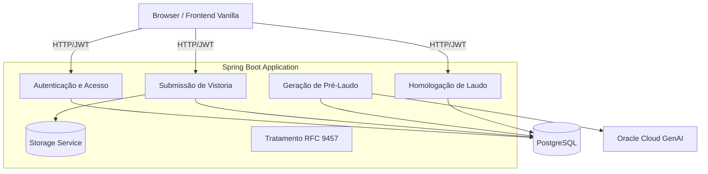

# Arquitetura do Vistoria Predial

O sistema Vistoria Predial é construído seguindo o padrão de **Monólito Modular por Feature**. Cada módulo de negócio (como usuário, vistoria e laudo) é isolado dentro do projeto, mas todas as features rodam em um único processo e deployment.

## 1. Stack Tecnológica
- **Backend:** Java 21 LTS + Spring Boot 4.1.1
- **Persistência:** PostgreSQL (via Spring Data JPA e Flyway)
- **Segurança:** Spring Security + JWT Stateless
- **Frontend:** Vanilla HTML5, CSS3, JavaScript (servido estaticamente ou templates)
- **IA Generativa:** OCI Generative AI (via Spring RestClient)

## 2. Diagrama de Módulos (C4 Nível 2 - Container)

## 3. Fluxo de Negócio (Human-in-the-loop)
1. **Registro/Acesso**: Cliente ou Engenheiro fazem login e recebem um token JWT.
2. **Submissão**: O Cliente (ROLE_CLIENTE) faz o upload de imagens (salvas via `StorageService`) e envia os detalhes do cômodo.
3. **Análise Preliminar**: Uma vez submetido, o sistema despacha os dados para a IA Multimodal (OCI), que analisa as patologias estruturais nas imagens e gera o Pré-Laudo. O laudo entra no status `PRE_LAUDO_GERADO`.
4. **Homologação Técnica**: O Engenheiro Civil (ROLE_ENGENHEIRO) entra no painel, avalia o pré-laudo, ajusta o que for necessário, e aprova (assina) com seu CREA. O status passa para `HOMOLOGADO`.

## 4. Decomposição de Entregas (Features)
Para evitar grandes implementações monolíticas, o projeto é fracionado em *entregas verticais*. Cada entrega contempla o fluxo de backend, API, regras de domínio e persistência necessários para aquele contexto.

- `autenticacao-e-acesso/`: Cadastro e geração de JWT.
- `submissao-de-vistoria/`: Upload de evidências e criação do registro inicial da vistoria.
- `geracao-de-pre-laudo/`: Orquestração com OCI GenAI.
- `homologacao-de-laudo/`: Auditoria e validação por parte do Engenheiro Civil.
